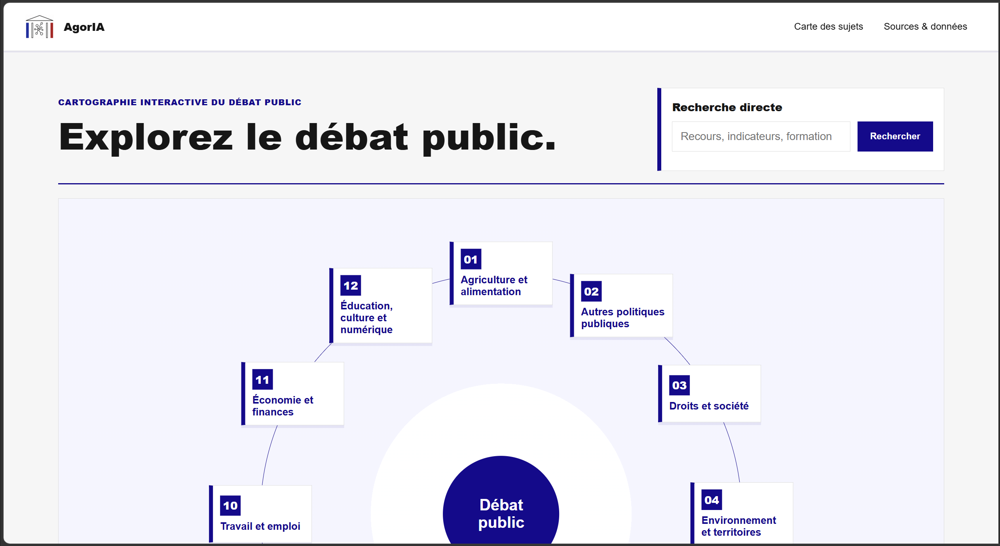

# AgorIA

<p align="center">
  
</p>

**AgorIA** est un prototype conçu pour le **hackathon de l’Assemblée nationale 2026**.

Son objectif est de rendre les données parlementaires plus compréhensibles en transformant des sources institutionnelles publiques - questions au Gouvernement, dossiers législatifs, documents parlementaires, acteurs, réponses et citations - en une interface d’exploration claire des sujets politiques, des positions et des arguments.

AgorIA ne cherche pas à remplacer les sources officielles. Le projet vise au contraire à les rendre plus lisibles, plus navigables et plus vérifiables.

---

## Pourquoi AgorIA ?

Les informations parlementaires sont riches, mais souvent dispersées : questions au Gouvernement, réponses ministérielles, rapports, propositions de loi, débats, amendements, dossiers législatifs et acteurs institutionnels sont disponibles, mais difficiles à relier entre eux.

Pour un citoyen, un journaliste, un chercheur, une association ou un acteur public, il est difficile de répondre simplement à des questions comme :

- quels sont les grands sujets débattus ?
- quels acteurs interviennent sur un sujet ?
- quelles positions défendent-ils ?
- quels arguments reviennent le plus souvent ?
- quelles citations exactes permettent de vérifier une position ?
- comment passer d’une masse de documents à une carte lisible du débat ?

AgorIA propose une réponse : **organiser le débat public parlementaire à partir de traces sourcées**.

---

## Objectif du prototype

Le prototype construit une couche de compréhension au-dessus des données parlementaires.

Il permet d’explorer :

- les grands thèmes politiques ;
- les catégories et sous-catégories de sujets ;
- les questions au Gouvernement ;
- les acteurs politiques et institutionnels ;
- les positions associées à un acteur et à un sujet ;
- les arguments résumés ;
- les citations exactes issues des échanges parlementaires ;
- les sources utilisées pour construire l’affichage.

L’ambition n’est pas de produire une synthèse politique opaque. L’ambition est de construire une interface où chaque élément important peut être relié à une donnée source.

---

## Ce que fait déjà le projet

La version actuelle du prototype permet déjà de :

- charger des données parlementaires prétraitées depuis `data/processed/` et `data/curated/` ;
- afficher les sujets dans une interface FastAPI / Jinja / JavaScript ;
- construire une navigation par catégories et sous-catégories ;
- afficher des fiches sujet ;
- rattacher des traces publiques à des sujets ;
- intégrer des enrichissements LLM pré-calculés, sans dépendre d’un LLM au moment de l’affichage ;
- extraire et importer des citations d’acteurs depuis les questions au Gouvernement ;
- associer acteur → sujet → position → argument → citation ;
- auditer la cohérence de la taxonomie actuelle.

Les dernières briques ajoutées portent sur les citations d’acteurs : environ 150 questions au Gouvernement ont été traitées, avec environ 300 citations et positions acteur/sujet extraites puis fusionnées dans `data/curated/agoria_raw_extract.json`.

---

## Principes de conception

AgorIA repose sur quelques principes simples.

### 1. Sources d’abord

Les données affichées doivent rester reliées à des sources publiques ou à des fichiers structurés issus de ces sources.

### 2. Pas d’IA en temps réel pour l’affichage principal

L’application publique lit des données déjà structurées. Les traitements LLM éventuels interviennent en amont, dans une pipeline contrôlée, relue et versionnable.

### 3. Séparation entre extraction, enrichissement et affichage

Le projet distingue :

- les sources brutes ;
- les données normalisées ;
- les enrichissements ;
- les données curated prêtes à afficher ;
- l’interface utilisateur.

### 4. Auditabilité

La taxonomie, les mappings et les citations doivent pouvoir être audités. Les scripts doivent produire des rapports lisibles, pas seulement modifier silencieusement les données.

### 5. Interface contrainte par la lisibilité

Le front est conçu pour afficher au maximum 12 enfants visibles par cercle. La taxonomie doit donc rester compacte, équilibrée et navigable.

---

## Organisation des données

```text
data/raw/        Sources officielles brutes, inchangées
data/processed/  Données normalisées ou enrichies automatiquement
data/curated/    Données prêtes à être affichées par l’application
data/reports/    Rapports d’audit et de contrôle qualité
data/schemas/    Contrats JSON
```

Le fichier principal actuellement utilisé par l’application est :

```text
data/curated/agoria_raw_extract.json
```

Il agrège notamment :

- les sujets ;
- les classifications ;
- les traces ;
- les acteurs ;
- les positions ;
- les citations extraites ;
- les métadonnées utiles à l’affichage.

---

## Pipeline actuelle

La logique générale est la suivante :

```text
Sources publiques
→ extraction / normalisation déterministe
→ données processed
→ enrichissements ciblés
→ fusion curated
→ audit qualité
→ affichage dans l’application
```

Pour les citations d’acteurs, le flux actuel est :

```text
data/processed/normalized_questions.json
→ scripts/build_actor_quote_queue.py
→ export de batches actor quotes
→ import des résultats enrichis
→ data/processed/actor_quotes.json
→ fusion dans data/curated/agoria_raw_extract.json
→ exploitation côté app
```

Pour la taxonomie, la nouvelle logique visée est :

```text
processed data
→ audit de taxonomie
→ rapport de problèmes
→ propositions de correction
→ remapping contrôlé
→ validation
→ export app
```

---

## Audit de taxonomie

Un audit déterministe de la taxonomie a été ajouté pour vérifier que les catégories restent compatibles avec l’interface et avec les objectifs de lisibilité.

Configuration des règles :

```text
config/taxonomy_rules.json
```

Seuils principaux :

```json
{
  "max_visible_children": 12,
  "target_visible_children_min": 5,
  "target_visible_children_max": 9,
  "preferred_depth": 3,
  "max_depth": 4,
  "ideal_leaf_subject_min": 20,
  "ideal_leaf_subject_max": 40,
  "split_leaf_subject_threshold": 50,
  "merge_leaf_subject_threshold": 5
}
```

Commande :

```bash
./scripts/audit_taxonomy.py \
  --input data/curated/agoria_raw_extract.json \
  --rules config/taxonomy_rules.json \
  --json-out data/reports/taxonomy_audit.json \
  --md-out data/reports/taxonomy_audit.md
```

Le rapport détecte notamment :

- les catégories avec trop d’enfants directs ;
- les feuilles avec trop de sujets ;
- les feuilles trop petites ;
- les chemins répétitifs du type `Santé > Santé` ;
- les labels vagues ;
- les doublons exacts ou quasi exacts ;
- les branches déséquilibrées ;
- les incohérences potentielles entre rubrique source et catégorie finale.

L’audit sert de base à une future étape de remapping contrôlé.

---

## État actuel de la taxonomie

L’audit actuel montre que la taxonomie est exploitable pour l’analyse, mais pas encore assez propre pour une navigation finale.

Les principaux problèmes identifiés sont :

- trop de catégories directement à la racine ;
- mélange entre thèmes politiques et types de documents parlementaires ;
- feuilles très volumineuses, notamment autour des propositions de loi ;
- nombreux chemins répétitifs ;
- plusieurs branches déséquilibrées.

La priorité n’est donc pas d’importer massivement de nouvelles données, mais de fiabiliser la taxonomie déjà produite.

---

## Installation

Créer un environnement Python :

```bash
python -m venv .venv
source .venv/bin/activate
pip install -r requirements.txt
```

Lancer l’application :

```bash
./scripts/run.sh
```

Puis ouvrir :

```text
http://127.0.0.1:8000
```

---

## Tests

Lancer la suite de tests :

```bash
PYTHONPATH=. pytest -q
```

Ou :

```bash
./scripts/test.sh
```

---

## Structure du projet

```text
app/
  main.py                         Routes FastAPI
  core/                           Modèles, configuration, taxonomie
  repositories/                   Accès aux données demo / processed / curated
  debate/                         Construction des cartes argumentatives
  civic/                          Aide à la formulation et orientation civique
  templates/                      Pages Jinja
  static/                         JS, CSS, images

scripts/
  build_curated_from_raw.py        Normalisation depuis les sources brutes
  enrich_with_llm.py               Enrichissement ciblé hors affichage live
  build_actor_quote_queue.py       Préparation des extractions de citations
  export_actor_quote_batch.py      Export de lots actor quotes
  import_actor_quote_batch.py      Import et fusion des citations d’acteurs
  audit_taxonomy.py                Audit read-only de la taxonomie

docs/
  architecture.md                  Architecture générale
  integration_donnees_reelles.md   Flux d’intégration des données réelles
  actor_quotes_workflow.md         Workflow des citations d’acteurs
  api/                             Documentation de prétraitement

config/
  taxonomy.yml                     Taxonomie argumentative historique
  taxonomy_rules.json              Règles d’audit de la taxonomie

data/
  demo/                            Données de démonstration
  processed/                       Données normalisées / enrichies
  curated/                         Données affichables
  reports/                         Rapports d’audit
  schemas/                         Schémas JSON

tests/
  Tests unitaires et smoke tests
```

---

## Données et ressources utilisées

Le projet cible les ressources ouvertes utiles à la compréhension du débat parlementaire, notamment :

- dossiers législatifs de l’Assemblée nationale ;
- amendements ;
- comptes rendus de séance ;
- députés en exercice ;
- questions au Gouvernement ;
- questions écrites et orales ;
- dossiers législatifs Légifrance ;
- ressources du Sénat ;
- base/API unifiée Parlement, Législation et Service Public.

La liste détaillée des ressources utilisées pour le défi est documentée dans :

```text
hackathon-an-2026/DEFI.md
```

---

## Prochaines étapes

Les prochaines étapes prioritaires sont :

1. stabiliser la taxonomie actuelle ;
2. générer des propositions de remapping contrôlées ;
3. distinguer clairement thèmes politiques et types de documents ;
4. valider les corrections avant application ;
5. relancer l’audit après chaque correction ;
6. améliorer l’interface d’exploration des acteurs, positions, arguments et citations.

---

## Vision

AgorIA veut aider à passer d’un débat parlementaire dispersé à une cartographie lisible, sourcée et vérifiable.

Le projet cherche à rendre visible ce qui a déjà été dit, débattu, contesté ou proposé, afin de mieux comprendre les enjeux publics et de faciliter une participation plus informée.
