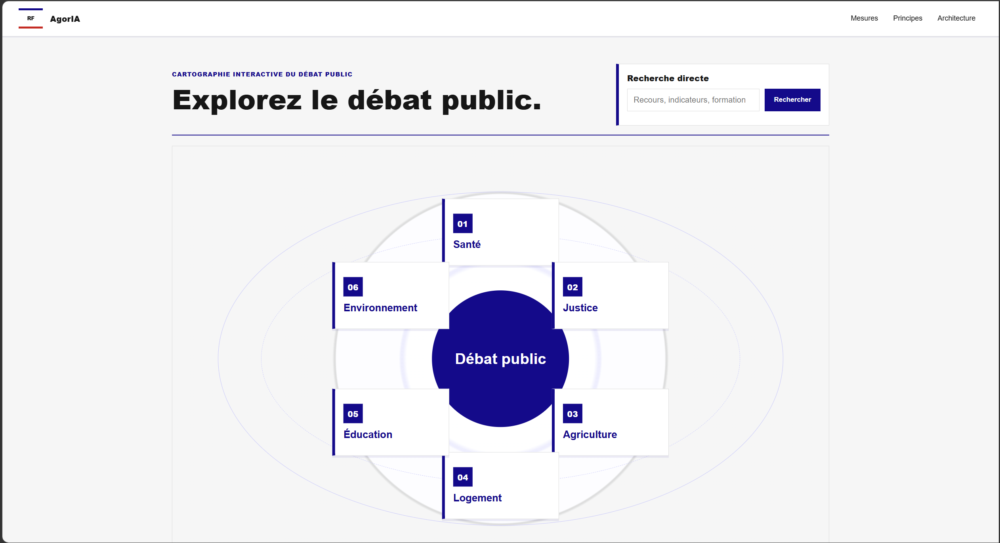

### Nom du défi
Cartographier le débat public pour mieux y participer

### Description courte
Une plateforme qui organise les traces publiques du débat parlementaire autour d'une mesure, explique ce qui est en jeu et aide les citoyens à préparer une intervention claire vers les voies officielles, sans collecter leurs opinions politiques par défaut.

### Porteur
GHULAM NABI Nily

### Description longue
**Le constat**

Le parcours d'une loi est difficile à suivre pour les citoyens. Entre les textes déposés, les amendements, les débats en séance, les questions parlementaires, les rapports et les réponses du Gouvernement, les arguments existent déjà, mais ils sont dispersés, techniques et peu accessibles.

Résultat : lorsqu'un citoyen veut comprendre une mesure, se faire un avis ou intervenir dans le débat public, il doit souvent repartir de zéro. Il ne sait pas toujours ce qui a déjà été discuté, quelles objections ont été soulevées, quelles alternatives ont été proposées, ni par quelle voie institutionnelle formuler utilement sa question, son constat ou sa proposition.

**La solution**

La plateforme utilise l'IA et les données ouvertes pour organiser les traces publiques du débat parlementaire et législatif autour d'une mesure.

À partir des textes, amendements, comptes rendus de séance, questions parlementaires, réponses du Gouvernement, rapports et dossiers législatifs, la plateforme construit une carte claire du débat public : ce que la mesure change, pour qui, avec quelles obligations, quels effets attendus, quels arguments favorables ou défavorables, quelles demandes de clarification et quelles alternatives ont été discutées.

L'objectif n'est pas de collecter les opinions politiques des citoyens ni de créer une nouvelle plateforme de doléances. La plateforme rend lisible le débat public déjà documenté, puis aide chacun à structurer sa propre réflexion.

La plateforme peut ensuite accompagner l'utilisateur dans la formulation d'une intervention : question à transmettre à un parlementaire, demande de clarification, proposition d'évolution, argumentaire de pétition, contribution à une consultation publique ou message à un représentant. L'utilisateur garde la main : la plateforme prépare, explique et oriente, mais ne transmet rien automatiquement.

**L'enjeu démocratique**

La plateforme veut renforcer la qualité du débat public en passant d'un avis isolé à une participation informée.

Côté citoyen : mieux comprendre les mesures, identifier les arguments existants, repérer les points de désaccord et formuler une intervention plus claire, plus utile et mieux orientée.

Côté institutionnel : valoriser les données parlementaires ouvertes, rendre visibles les controverses déjà exprimées et encourager une participation qui s'inscrit dans les voies officielles plutôt que dans une arène parallèle.

La plateforme ne cherche pas à savoir qui pense quoi. Elle cherche à rendre compréhensible ce qui a déjà été dit, discuté, contesté ou proposé, afin que chacun puisse mieux se situer dans le débat et agir de manière éclairée.

**Le déroulé pour le hackathon**

1. Sélection d'une mesure, d'un article ou d'un texte législatif.
2. Génération d'une fiche claire : ce qui change, pour qui, à quelle échéance, avec quelles obligations et quels effets attendus.
3. Cartographie du débat public à partir des sources ouvertes : arguments favorables, objections, nuances, alternatives, questions parlementaires et difficultés d'application.
4. Affichage des traces publiques utilisées : amendements, débats, questions, réponses du Gouvernement, rapports.
5. Atelier d'aide à la réflexion : l'utilisateur précise s'il veut poser une question, formuler un constat, proposer une évolution ou préparer une contribution.
6. Génération d'un brouillon structuré, sourcé et révisable.
7. Orientation vers la voie institutionnelle adaptée : parlementaire, pétition, consultation publique ou autre canal officiel pertinent.

**Stack envisagée**

- Backend : FastAPI.
- Frontend : Jinja puis évolution possible vers Next.js, Vue ou Svelte.
- Données : API ou base unifiée Parlement / Législation / Service Public.
- IA : RAG sourcé, classification argumentative, extraction de mesures, génération contrôlée.
- Base de données cible : PostgreSQL avec extension vectorielle ou moteur de recherche dédié.
- Principes de confiance : sources obligatoires, séparation fait/opinion/interprétation, pas de collecte d'opinions politiques par défaut, pas de transmission automatique, brouillons privés et temporaires.

### Image principale

### Contributeurs
- Camellia

### Ressources utilisées
Cochez les ressources utilisées en remplaçant `[ ]` par `[x]`.

- [ ] `openfisca-france-parameters` — Base de données de paramètres ✺ OpenFisca
- [x] `an-dossiers-legislatifs` — Dossiers législatifs de l'Assemblée nationale (législature courante) ✺ Assemblée nationale
- [x] `an-amendements-xvii` — Amendements déposés à l'Assemblée nationale (législature actuelle) ✺ Assemblée nationale
- [x] `an-comptes-rendus` — Comptes rendus de la séance publique à l'Assemblée nationale (législature actuelle) ✺ Assemblée nationale
- [ ] `an-votes-xvii` — Votes des députés (législature actuelle) ✺ Assemblée nationale
- [x] `an-deputes-en-exercice` — Députés en exercice ✺ Assemblée nationale
- [ ] `an-deputes-historique` — Historique des députés ✺ Assemblée nationale
- [ ] `an-deputes-senateurs-ministres-par-legislature` — Députés, sénateurs et ministres d'une législature ✺ Assemblée nationale
- [x] `an-agenda-reunions` — Agenda des réunions à l'Assemblée nationale (législature courante) ✺ Assemblée nationale
- [x] `an-questions-gouvernement` — Questions de l'Assemblée nationale au Gouvernement ✺ Assemblée nationale
- [x] `an-questions-gouvernement-ecrites` — Questions écrites de l'Assemblée nationale au Gouvernement ✺ Assemblée nationale
- [x] `an-questions-gouvernement-orales` — Questions orales de l'Assemblée nationale au Gouvernement ✺ Assemblée nationale
- [x] `premier-ministre-legi` — Codes, lois et règlements consolidés ✺ Premier ministre
- [x] `premier-ministre-dole` — Dossiers législatifs Légifrance ✺ Premier ministre
- [ ] `premier-ministre-jorf` — Édition ''Lois et décrets'' du Journal officiel ✺ Premier ministre
- [x] `senat-dispositifs-textes` — Dispositifs des textes déposés ou adoptés au Sénat ✺ Sénat
- [x] `senat-dossiers-legislatifs` — Dossiers législatifs du Sénat ✺ Sénat
- [x] `senat-amendements` — Amendements déposés au Sénat ✺ Sénat
- [x] `senat-senateurs` — Sénateurs ✺ Sénat
- [x] `senat-questions-gouvernement` — Questions orales et écrites du Sénat au Gouvernement ✺ Sénat
- [x] `senat-comptes-rendus` — Comptes rendus de la séance publique au Sénat ✺ Sénat
- [x] `an-et-co-database-regroupement-toutes-donnees` — Base de données unifiée Parlement / Législation / Service Public ✺ Assemblée nationale & communauté
- [ ] `an-et-co-serveur-mcp-regroupement-toutes-donnees` — Serveur MCP  - Accès unifié Parlement / Législation / Service Public ✺ Assemblée nationale & communauté
- [x] `an-et-co-api-regroupement-toutes-donnees` — API - Accès unifié Parlement / Législation / Service Public ✺ Assemblée nationale & communauté
- [ ] `legiwatch-api-parlement` — API Parlement ✺ LegiWatch
- [ ] `legiwatch-database-parlement` — Base de données Parlement ✺ LegiWatch
- [ ] `legiwatch-serveur-mcp-parlement` — Serveur MCP Parlement ✺ LegiWatch

### Galerie
- [Image 1](images/cover.png)

### Documents

